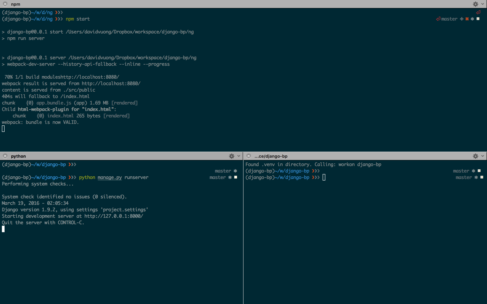

# Django + AngularJS Boilerplate

[](https://www.python.org/dev/peps/pep-0008/)
[](https://github.com/airbnb/javascript)

**Welcome to django-bp!**

This is a simple kickstart project to get you setup with Django, DRF, and AngularJS. It's currently configured to use Django v1.9 and DRF (Django REST Framework) v3.3, running on the Python 2.7 runtime.

The AngularJS (v1.5) client-side app is configured to use ES6 (via Babel), Webpack for bundling, and SCSS as the CSS pre-processor. The source can be found under `/django-bp/ng/`.

For all other dependencies refer to the `project/requirements.txt` and `ng/package.json` files for Django and AngularJS respectively. Please continue reading for the setup guide.

## Getting Started

1. Clone the project repository:

  ```bash
  git clone https://github.com/davidvuong/django-bp
  ```

1. Install `pip`, `virtualenv`, and `virtualenvwrapper`:

  ```bash
  sudo easy_install pip
  sudo pip install virtualenv virtualenvwrapper
  ```

1. Create a Python virtualenv using `virtualenvwrapper`:

  ```bash
  mkvirtualenv django-bp
  add2virtualenv project
  workon django-bp
  ```

1. Install all Python dependencies:

  ```bash
  pip install requirements.txt
  ```

1. Install the latest version of Node (currently v5.8):

  ```bash
  nvm install 5.8
  nvm use 5.8
  ```

1. `cd` into `ng/` and install JavaScript dependencies:

  ```bash
  npm install
  ```

## Configuring Django

Most of the configuration is already done (`/project/settings.py`) however, there is a bit of initial manual configuration that need to be handled.

1. Export the `DJANGO_SETTINGS_MODULE` environment variable.

  ```bash
  export DJANGO_SETTINGS_MODULE='project.settings'
  ```

1. Next, you'll need to run the database migrations:

  ```bash
  python manage.py migrate
  ```

1. Lastly, you'll need to create a `superuser`:

  ```bash
  python manage.py createsuperuser
  ```

In regards to the database, this kickstart has Django running on SQLite but you can obviously change it to use any RDBMS or NoSQL database. For simplicity and ease of configuration, I'm using SQLite.

## Executing `django-bp`

Whilst developing, there are 2 servers that you need to run. The first is `webpack-dev-server` and the other is your Django server:



1. The first command bundles your client and starts the `webpack-dev-server`:

  ```bash
  npm start
  ```

1. The second command starts your Django server:

  ```bash
  python manage.py runserver
  ```

*Note: Please make sure that when running any client-side related commands to be in the django-bp/ng/ directory.*
